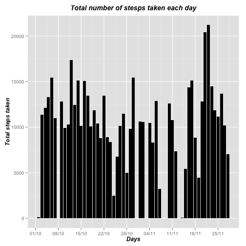

# Reproducible Research: Peer Assessments 1

## Loading and procesing the data


```r
## Installing packages to transform minutes into HH:MM
library(lubridate)

## Installing packages to print tables
library(xtable)

## Other required packages
library(ggplot2)
library(scales)
library(dplyr)
```


```r
## Reading activity data
original_activity_data<-read.csv("activity.csv",stringsAsFactors=FALSE)
complete_activity_data<-original_activity_data

## Transforming interval (minutes) into HH:MM format in a new variable
complete_activity_data$HHMM<-sprintf("%04d",complete_activity_data$interval)
complete_activity_data$HHMM<-format(strptime(complete_activity_data$HHMM, format="%H%M"), format = "%H:%M")

## Creating new POSIXct variable with the following format "YY-MM-DD HH:MM"
complete_activity_data$date_time<-paste(complete_activity_data$date,complete_activity_data$HHMM,sep=" ")
complete_activity_data$date<-as.POSIXct(complete_activity_data$date)
complete_activity_data$date_time<-ymd_hm(complete_activity_data$date_time)

## Creating new variable identifying the week day
complete_activity_data$week_day<-wday(complete_activity_data$date,label=TRUE)

## Removing incompleted cases (rows including NAs)
activity_data<-complete_activity_data[complete.cases(complete_activity_data),]
```

## What is mean total number of steps taken per day?

### Histogram of total steps taken each day


```r
## building plot data set (day, total steps)

## NAs not considered 
plot1_data<-summarize(group_by(activity_data,date),Total_daily_steps=sum(steps,na.rm=TRUE))

## plotting histogram

plot1<-ggplot(plot1_data,aes(date,Total_daily_steps))
plot1+
  geom_bar(stat="identity",fill="black")+
  scale_x_datetime(breaks = date_breaks("1 week"),labels = date_format("%d/%m"))+
  labs(title="Total number of stesps taken each day")+
  theme(plot.title=element_text(vjust=1.5,face="bold.italic",size=14))+
  theme(axis.title=element_text(vjust=0.5,face="bold.italic",size=12))+
  xlab("Days")+
  ylab("Total steps taken")
```

 

### Mean and median steps calculation


```r
mean_steps<-round(mean(plot1_data$Total_daily_steps),digits=2)
median_steps<-median(plot1_data$Total_daily_steps)
```

The mean of the total number of steps taken per day is 10766.19 and the median 10765

## What is the average daily activity pattern?

### Time series for daily activity pattern


```r
## building plot data set (5 minutes time-slot, total steps). NAs not considered 

activity_data$time<-as.POSIXct(activity_data$HHMM,format="%H:%M")
plot2_data<-summarize(group_by(activity_data,time),Total_daily_steps=sum(steps,na.rm=TRUE))
plot2_data$Average_daily_steps<-plot2_data$Total_daily_steps/length(unique(activity_data$date))

## plotting time series

plot2<-ggplot(plot2_data,aes(time,Average_daily_steps))
plot2+
  geom_line(stat="identity",fill="black")+
  scale_x_datetime(breaks = date_breaks("2 hour"),labels = date_format("%H h"))+
  labs(title="Average daily activity pattern")+
  theme(plot.title=element_text(vjust=1.5,face="bold.italic",size=14))+
  theme(axis.title=element_text(vjust=0.5,face="bold.italic",size=12))+
  xlab("Time (5 minute interval)")+
  ylab("Average steps taken")
```

 

### Searching for the 5 minutes interval with highest activity


```r
higuest_value<-plot2_data[plot2_data$Total_daily_steps==max(plot2_data$Total_daily_steps),]
higuest_value$time<-strftime(higuest_value$time,format="%H:%M")
higuest_value$Average_daily_steps<-round(higuest_value$Average_daily_steps,digits=2)
```

08:35 is the 5-minute interval with maximum number of steps: 
    10927 total steps
    and 206.17 average steps taken per day
    

## Imputing missing values

### Calculating the total number of missing values in the dataset


```r
table_data<-summarize(group_by(original_activity_data,date),Not_NA=sum(!is.na(steps)),NAs=sum(is.na(steps)))

xt<-xtable(table_data)
print(xt,type="html")
```

<!-- html table generated in R 3.1.1 by xtable 1.7-4 package -->
<!-- Sun Mar 15 22:51:42 2015 -->
<table border=1>
<tr> <th>  </th> <th> date </th> <th> Not_NA </th> <th> NAs </th>  </tr>
  <tr> <td align="right"> 1 </td> <td> 2012-10-01 </td> <td align="right">   0 </td> <td align="right"> 288 </td> </tr>
  <tr> <td align="right"> 2 </td> <td> 2012-10-02 </td> <td align="right"> 288 </td> <td align="right">   0 </td> </tr>
  <tr> <td align="right"> 3 </td> <td> 2012-10-03 </td> <td align="right"> 288 </td> <td align="right">   0 </td> </tr>
  <tr> <td align="right"> 4 </td> <td> 2012-10-04 </td> <td align="right"> 288 </td> <td align="right">   0 </td> </tr>
  <tr> <td align="right"> 5 </td> <td> 2012-10-05 </td> <td align="right"> 288 </td> <td align="right">   0 </td> </tr>
  <tr> <td align="right"> 6 </td> <td> 2012-10-06 </td> <td align="right"> 288 </td> <td align="right">   0 </td> </tr>
  <tr> <td align="right"> 7 </td> <td> 2012-10-07 </td> <td align="right"> 288 </td> <td align="right">   0 </td> </tr>
  <tr> <td align="right"> 8 </td> <td> 2012-10-08 </td> <td align="right">   0 </td> <td align="right"> 288 </td> </tr>
  <tr> <td align="right"> 9 </td> <td> 2012-10-09 </td> <td align="right"> 288 </td> <td align="right">   0 </td> </tr>
  <tr> <td align="right"> 10 </td> <td> 2012-10-10 </td> <td align="right"> 288 </td> <td align="right">   0 </td> </tr>
  <tr> <td align="right"> 11 </td> <td> 2012-10-11 </td> <td align="right"> 288 </td> <td align="right">   0 </td> </tr>
  <tr> <td align="right"> 12 </td> <td> 2012-10-12 </td> <td align="right"> 288 </td> <td align="right">   0 </td> </tr>
  <tr> <td align="right"> 13 </td> <td> 2012-10-13 </td> <td align="right"> 288 </td> <td align="right">   0 </td> </tr>
  <tr> <td align="right"> 14 </td> <td> 2012-10-14 </td> <td align="right"> 288 </td> <td align="right">   0 </td> </tr>
  <tr> <td align="right"> 15 </td> <td> 2012-10-15 </td> <td align="right"> 288 </td> <td align="right">   0 </td> </tr>
  <tr> <td align="right"> 16 </td> <td> 2012-10-16 </td> <td align="right"> 288 </td> <td align="right">   0 </td> </tr>
  <tr> <td align="right"> 17 </td> <td> 2012-10-17 </td> <td align="right"> 288 </td> <td align="right">   0 </td> </tr>
  <tr> <td align="right"> 18 </td> <td> 2012-10-18 </td> <td align="right"> 288 </td> <td align="right">   0 </td> </tr>
  <tr> <td align="right"> 19 </td> <td> 2012-10-19 </td> <td align="right"> 288 </td> <td align="right">   0 </td> </tr>
  <tr> <td align="right"> 20 </td> <td> 2012-10-20 </td> <td align="right"> 288 </td> <td align="right">   0 </td> </tr>
  <tr> <td align="right"> 21 </td> <td> 2012-10-21 </td> <td align="right"> 288 </td> <td align="right">   0 </td> </tr>
  <tr> <td align="right"> 22 </td> <td> 2012-10-22 </td> <td align="right"> 288 </td> <td align="right">   0 </td> </tr>
  <tr> <td align="right"> 23 </td> <td> 2012-10-23 </td> <td align="right"> 288 </td> <td align="right">   0 </td> </tr>
  <tr> <td align="right"> 24 </td> <td> 2012-10-24 </td> <td align="right"> 288 </td> <td align="right">   0 </td> </tr>
  <tr> <td align="right"> 25 </td> <td> 2012-10-25 </td> <td align="right"> 288 </td> <td align="right">   0 </td> </tr>
  <tr> <td align="right"> 26 </td> <td> 2012-10-26 </td> <td align="right"> 288 </td> <td align="right">   0 </td> </tr>
  <tr> <td align="right"> 27 </td> <td> 2012-10-27 </td> <td align="right"> 288 </td> <td align="right">   0 </td> </tr>
  <tr> <td align="right"> 28 </td> <td> 2012-10-28 </td> <td align="right"> 288 </td> <td align="right">   0 </td> </tr>
  <tr> <td align="right"> 29 </td> <td> 2012-10-29 </td> <td align="right"> 288 </td> <td align="right">   0 </td> </tr>
  <tr> <td align="right"> 30 </td> <td> 2012-10-30 </td> <td align="right"> 288 </td> <td align="right">   0 </td> </tr>
  <tr> <td align="right"> 31 </td> <td> 2012-10-31 </td> <td align="right"> 288 </td> <td align="right">   0 </td> </tr>
  <tr> <td align="right"> 32 </td> <td> 2012-11-01 </td> <td align="right">   0 </td> <td align="right"> 288 </td> </tr>
  <tr> <td align="right"> 33 </td> <td> 2012-11-02 </td> <td align="right"> 288 </td> <td align="right">   0 </td> </tr>
  <tr> <td align="right"> 34 </td> <td> 2012-11-03 </td> <td align="right"> 288 </td> <td align="right">   0 </td> </tr>
  <tr> <td align="right"> 35 </td> <td> 2012-11-04 </td> <td align="right">   0 </td> <td align="right"> 288 </td> </tr>
  <tr> <td align="right"> 36 </td> <td> 2012-11-05 </td> <td align="right"> 288 </td> <td align="right">   0 </td> </tr>
  <tr> <td align="right"> 37 </td> <td> 2012-11-06 </td> <td align="right"> 288 </td> <td align="right">   0 </td> </tr>
  <tr> <td align="right"> 38 </td> <td> 2012-11-07 </td> <td align="right"> 288 </td> <td align="right">   0 </td> </tr>
  <tr> <td align="right"> 39 </td> <td> 2012-11-08 </td> <td align="right"> 288 </td> <td align="right">   0 </td> </tr>
  <tr> <td align="right"> 40 </td> <td> 2012-11-09 </td> <td align="right">   0 </td> <td align="right"> 288 </td> </tr>
  <tr> <td align="right"> 41 </td> <td> 2012-11-10 </td> <td align="right">   0 </td> <td align="right"> 288 </td> </tr>
  <tr> <td align="right"> 42 </td> <td> 2012-11-11 </td> <td align="right"> 288 </td> <td align="right">   0 </td> </tr>
  <tr> <td align="right"> 43 </td> <td> 2012-11-12 </td> <td align="right"> 288 </td> <td align="right">   0 </td> </tr>
  <tr> <td align="right"> 44 </td> <td> 2012-11-13 </td> <td align="right"> 288 </td> <td align="right">   0 </td> </tr>
  <tr> <td align="right"> 45 </td> <td> 2012-11-14 </td> <td align="right">   0 </td> <td align="right"> 288 </td> </tr>
  <tr> <td align="right"> 46 </td> <td> 2012-11-15 </td> <td align="right"> 288 </td> <td align="right">   0 </td> </tr>
  <tr> <td align="right"> 47 </td> <td> 2012-11-16 </td> <td align="right"> 288 </td> <td align="right">   0 </td> </tr>
  <tr> <td align="right"> 48 </td> <td> 2012-11-17 </td> <td align="right"> 288 </td> <td align="right">   0 </td> </tr>
  <tr> <td align="right"> 49 </td> <td> 2012-11-18 </td> <td align="right"> 288 </td> <td align="right">   0 </td> </tr>
  <tr> <td align="right"> 50 </td> <td> 2012-11-19 </td> <td align="right"> 288 </td> <td align="right">   0 </td> </tr>
  <tr> <td align="right"> 51 </td> <td> 2012-11-20 </td> <td align="right"> 288 </td> <td align="right">   0 </td> </tr>
  <tr> <td align="right"> 52 </td> <td> 2012-11-21 </td> <td align="right"> 288 </td> <td align="right">   0 </td> </tr>
  <tr> <td align="right"> 53 </td> <td> 2012-11-22 </td> <td align="right"> 288 </td> <td align="right">   0 </td> </tr>
  <tr> <td align="right"> 54 </td> <td> 2012-11-23 </td> <td align="right"> 288 </td> <td align="right">   0 </td> </tr>
  <tr> <td align="right"> 55 </td> <td> 2012-11-24 </td> <td align="right"> 288 </td> <td align="right">   0 </td> </tr>
  <tr> <td align="right"> 56 </td> <td> 2012-11-25 </td> <td align="right"> 288 </td> <td align="right">   0 </td> </tr>
  <tr> <td align="right"> 57 </td> <td> 2012-11-26 </td> <td align="right"> 288 </td> <td align="right">   0 </td> </tr>
  <tr> <td align="right"> 58 </td> <td> 2012-11-27 </td> <td align="right"> 288 </td> <td align="right">   0 </td> </tr>
  <tr> <td align="right"> 59 </td> <td> 2012-11-28 </td> <td align="right"> 288 </td> <td align="right">   0 </td> </tr>
  <tr> <td align="right"> 60 </td> <td> 2012-11-29 </td> <td align="right"> 288 </td> <td align="right">   0 </td> </tr>
  <tr> <td align="right"> 61 </td> <td> 2012-11-30 </td> <td align="right">   0 </td> <td align="right"> 288 </td> </tr>
   </table>

```r
dates_wo_values<-unique(original_activity_data$date[is.na(original_activity_data$step)])
```

Total missing values: 2304 
that corresponds to the full values from the following dates 2012-10-01, 2012-10-08, 2012-11-01, 2012-11-04, 2012-11-09, 2012-11-10, 2012-11-14, 2012-11-30

### Filling missing values with the mean of the 5 minutes interval


```r
ind<-which(is.na(complete_activity_data$steps),arr.ind=TRUE)

for(i in 1:length(ind)){
        minutes<-minute(complete_activity_data[ind[i],]$date_time)
        hours<-hour(complete_activity_data[ind[i],]$date_time)
        time_index<-hours*12+minutes/5+1
        complete_activity_data[ind[i],]$steps=plot2_data[time_index,]$Average_daily_steps      
}
```

### Histogram of total steps taken each day (imputing missing values)


```r
## building plot data set (day, total steps)

plot3_data<-summarize(group_by(complete_activity_data,date),Total_daily_steps=sum(steps,na.rm=TRUE))

## plotting histogram

plot3<-ggplot(plot3_data,aes(date,Total_daily_steps))
plot3+
  geom_bar(stat="identity",fill="black")+
  scale_x_datetime(breaks = date_breaks("1 week"),labels = date_format("%d/%m"))+
  labs(title="Total number of stesps taken each day")+
  theme(plot.title=element_text(vjust=1.5,face="bold.italic",size=14))+
  theme(axis.title=element_text(vjust=0.5,face="bold.italic",size=12))+
  xlab("Days")+
  ylab("Total steps taken")
```

 

```r
mean_steps<-round(mean(plot3_data$Total_daily_steps),digits=2)
median_steps<-median(plot3_data$Total_daily_steps)
```

The mean of the total number of steps taken per day is 10766.19 and the median 10766.19

There's no impact on the mean because the eight days without data were populated with average steps for each 5 minutes slots, resulting in an average pattern

Median results in one of the filled cases, thats why the result is not an integer and match with the average. In any case is quite close to the median value obtained excluding missing values

## Are there differences in activity patterns between weekdays and weekends?

### Creating a new variable indicating whether a given date is a weekday or weekend day


```r
complete_activity_data$Weekday <- as.factor(ifelse(complete_activity_data$week_day %in% c("Sat","Sun"), "weekend", "weekday"))
```

### Pannel plot to show step patterns for weekdays and weekends


```r
complete_activity_data$time<-as.POSIXct(complete_activity_data$HHMM,format="%H:%M")
plot4_data<-summarize(group_by(complete_activity_data,time,Weekday),Average_daily_steps=mean(steps,na.rm=TRUE))  

## plotting  
plot4<-ggplot(plot4_data,aes(time,Average_daily_steps))
plot4+
  facet_grid(.~Weekday)+
  geom_line(stat="identity",fill="black")+
  scale_x_datetime(breaks = date_breaks("2 hour"),labels = date_format("%H"))+
  labs(title="Average daily activity pattern")+
  theme(plot.title=element_text(vjust=1.5,face="bold.italic",size=14))+
  theme(axis.title=element_text(vjust=0.5,face="bold.italic",size=12))+
  xlab("Time (5 minute interval)")+
  ylab("Average steps taken")
```

 

The activity concentrates early in the morning during the weekdays, while the weekends show a more homogeneous distribution along the day
